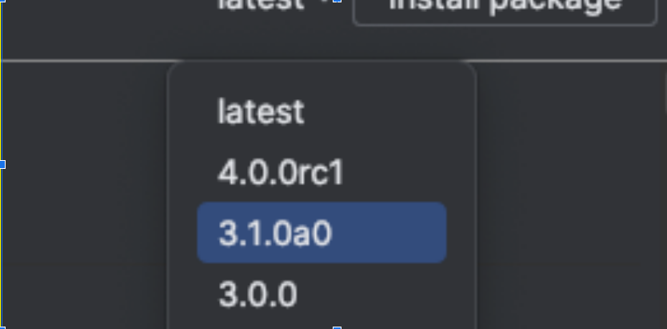
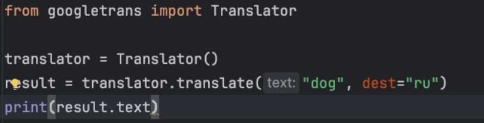

# zerocoder_lessons
 Сейчас игра получает английское слово и английское определение. Сделайте так, чтобы слова и определения этих слов были на русском. Для этого понадобится модуль 
___googletrans___
 
С именно такой версией

Пример кода:

